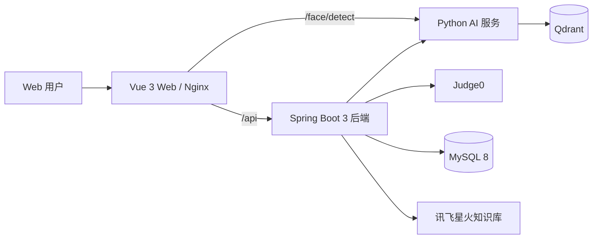

# 智能教学平台

面向管理员、教师和学生的一体化教学平台，覆盖课程与资源管理、备课 Agent、作业与编程评测、学习诊断、知识图谱和疲劳检测等功能。

## 系统组成



| 模块 | 技术 | 目录 |
|---|---|---|
| Java 后端 | Java 21、Spring Boot 3.5、MyBatis-Plus、Flyway | `src/` |
| Web 前端 | Vue 3、TypeScript、Vite、Ant Design Vue | `teach-frontend/` |
| AI 与 Agent | Python 3.10、Flask、Qdrant、Sentence Transformers | `teach-ai-server/` |
| 基础设施 | MySQL、Qdrant、Nginx、Docker Compose | `compose.yml` |
| 编程评测 | Judge0 独立编排 | `deploy/judge0/` |

## 快速启动

推荐使用 Docker Compose 启动核心服务。

环境要求：

- Docker Desktop，或支持 Compose v2 的 Docker Engine
- Git
- 首次构建 AI 镜像时需要稳定网络

在项目根目录执行：

```powershell
if (-not (Test-Path .env)) {
    Copy-Item .env.example .env
}
```

打开本地 `.env`，至少替换：

```text
DOCKER_DB_PASSWORD
DOCKER_DB_ROOT_PASSWORD
```

`.env` 已被 Git 忽略。不要把真实密码或 API Key 写入 `.env.example`。

启动并检查：

```powershell
docker compose config
docker compose build
docker compose up -d
docker compose ps
```

全部服务变为 `healthy` 后访问：

| 入口 | 默认地址 |
|---|---|
| Web | http://localhost:8080 |
| 后端健康检查 | http://localhost:8820/api/actuator/health |
| AI 健康检查 | http://localhost:5000/health |
| Qdrant 控制台 | http://localhost:6333/dashboard |

基础服务启动不要求填写外部 AI、语音或 OSS 密钥；对应在线功能需要有效凭证后才能正常调用。

### 星火课程知识库

星火知识库只由 Java 后端访问，`APP ID` 和 `Secret` 不会下发到浏览器。配置环境变量：

```text
XFYUN_KNOWLEDGE_ENABLED=true
XFYUN_KNOWLEDGE_APP_ID=你的知识库应用ID
XFYUN_KNOWLEDGE_SECRET=你的知识库接口密钥
```

执行 `V8__add_course_knowledge_base_binding.sql` 后，以管理员身份访问
`/admin/knowledge-base`。页面支持创建知识库、上传文档、查看向量状态、导入内置数据结构资料包，
并将知识库绑定到课程。资料达到 `vectored` 状态后，学生 AI 助手与数字人会在回答前检索课程资料，
命中内容以 `[资料N]` 标注；未达到可信阈值时保持原 AI 回答并明确不使用课程资料依据。

停止服务并保留数据：

```powershell
docker compose down
```

不要随意执行 `docker compose down -v`，该命令会删除 Compose 数据卷。

## 本地验证

完整验证需要 Docker Desktop 处于运行状态：

```powershell
powershell -ExecutionPolicy Bypass -File .\scripts\verify-project.ps1
powershell -ExecutionPolicy Bypass -File .\scripts\check-secrets.ps1
```

当前自动检查覆盖：

- Java 后端 114 项测试与隔离 MySQL 迁移
- Web 类型检查和生产构建
- Python Agent 48 项测试
- 20 条固定 Agent 评测任务
- Compose 配置与明文凭证扫描

每次推送和合并请求也会触发 `.github/workflows/ci.yml` 中的 GitHub Actions 流水线。

## 安全约定

- `.env`、`judge0.env.local` 和本机路径配置不得提交。
- 生产环境必须使用独立强密码，并通过 HTTPS 提供服务。
- 已有数据库首次接入 Flyway 前必须备份并核对结构。
- 真实密钥轮换后，应先验证新密钥，再撤销旧密钥。
- 提交前执行 `scripts/check-secrets.ps1`，扫描结果不会输出凭证值。
