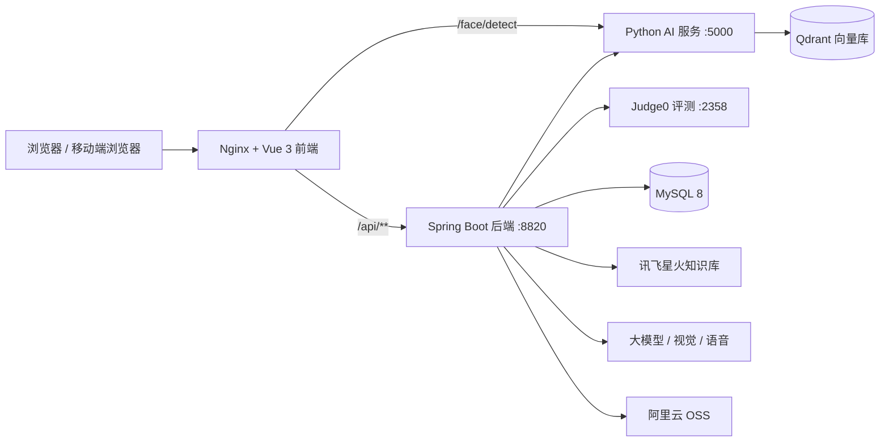

# 智能教学平台

面向管理员、教师和学生的一体化教学平台。覆盖课程与资源管理、AI 备课 Agent、作业与编程评测、学习诊断、知识图谱与课堂状态分析，并接入大模型、语音与数字人能力。

**技术栈**

`Java 21` · `Spring Boot 3.5` · `MyBatis-Plus` · `Flyway` · `MySQL 8` · `Vue 3` · `TypeScript` · `Vite` · `Ant Design Vue` · `Python 3.10` · `Flask` · `Qdrant` · `Judge0` · `Docker Compose`

---

## 目录

- [一、项目介绍](#一项目介绍)
- [二、系统架构](#二系统架构)
- [三、部署教程](#三部署教程)
- [四、验证与测试](#四验证与测试)
- [五、安全约定](#五安全约定)
- [附：外部服务依赖](#附外部服务依赖)

---

## 一、项目介绍

### 1.1 项目定位

平台把"课程管理 — 教学活动 — 学习行为 — 智能分析"四件事连成一条链路：教师在平台上组织课程与作业，学生完成学习与练习，系统记录学习行为并给出可解释的诊断与推荐，管理员负责用户、班级、培养方案与内容审核。

设计上强调三点：

1. **资源可用**：进入课程的每份资料都带封面、章节与正文，不做"只有标题的空壳资源"。
2. **推荐可解释**：推荐结果说明来源与目标，不使用黑盒结果。
3. **边界清晰**：AI 只做辅助建议，涉及成绩与权限的操作始终由教师或管理员确认。

### 1.2 角色与主要能力

| 角色 | 主要能力 |
|---|---|
| **管理员** | 用户 / 班级 / 专业培养方案管理、课程与 AI 资源审核、平台教学案例库、数据批量导入导出、数据库备份与恢复、模型配置、系统健康检查、操作审计日志 |
| **教师** | 课程与章节管理、AI 备课 Agent（教案 / 试题 / 课件生成）、教学案例检索与推荐、作业与考试发布及批改、编程题与在线评测、学情分析与班级对比、教师课表 |
| **学生** | 课程与视频学习、每日推荐与学习计划、AI 助手与数字人答疑、作业 / 考试提交、编程练习、学习诊断与知识图谱、心理状态与疲劳记录、学习社区 |

### 1.3 技术要点

- **统一响应与异常**：全局异常处理器覆盖 16 类异常，参数校验按字段返回错误信息，生产环境不向外泄露堆栈。
- **全链路 trace_id**：过滤器生成并透传 trace_id（含异步线程的 MDC 重绑定），日志与响应头一致，便于定位单次请求。
- **双通道身份**：浏览器 Cookie 会话 + 多标签页独立 Bearer 令牌；令牌使用 SHA-256 摘要与常量时间比较，避免时序侧信道。
- **密码安全**：BCrypt 存储，兼容历史 MD5 哈希并在登录时自动升级。
- **数据库迁移**：Flyway 版本化迁移（8 个版本），开启 `validate-on-migrate`、`clean-disabled`，生产环境默认启用。
- **参数化查询**：MyBatis XML 全部使用 `#{}` 占位符，不存在字符串拼接 SQL。
- **AI 接口治理**：`/ai/**` 按登录用户做每分钟滑动窗口限流；教师专属接口（`/ai/teacher/**` 等）强制角色校验。
- **代码执行双模式**：生产默认走 Judge0 沙箱；本地模式启动时打印明确 WARN，避免无隔离执行被误带上线。
- **备份与公开目录隔离**：数据库备份目录与匿名静态目录强制分离，配置错误时启动期直接报错。

### 1.4 项目规模

| 模块 | 规模 |
|---|---|
| Java 后端 | 461 个源文件 / 约 4.2 万行 |
| Java 测试 | 51 个测试类 / **166 个用例** |
| Web 前端 | 76 个 `.vue` + 38 个 `.ts` / 约 8.2 万行 |
| Python AI 服务 | 28 个文件 / 约 0.8 万行，**49 个用例** |
| REST 接口 | **315 个**端点 / 58 个 Controller |
| 数据表 | 62 张（Flyway V1 基线 + V2–V8 增量） |

---

## 二、系统架构

### 2.1 架构图


```mermaid
flowchart LR
    U["浏览器 / 移动端浏览器"] --> F["Nginx + Vue 3 前端"]

    F -->|"/api/**"| B["Spring Boot 后端 :8820"]
    F -->|"/face/detect"| A["Python AI 服务 :5000"]

    B --> A
    B --> J["Judge0 评测 :2358"]
    B --> DB[("MySQL 8")]
    B --> X["讯飞星火知识库"]
    B --> M["大模型 / 视觉 / 语音"]
    A --> Q[("Qdrant 向量库")]

    B --> O["阿里云 OSS"]
```

### 2.2 模块与技术栈

| 模块 | 目录 | 技术 |
|---|---|---|
| Java 后端 | `src/` | Java 21、Spring Boot 3.5.9、MyBatis-Plus 3.5.15、Flyway、MySQL 8、Knife4j |
| Web 前端 | `teach-frontend/` | Vue 3.5、TypeScript、Vite、Ant Design Vue 4、Pinia、Vue Router 4、ECharts 6、Axios |
| AI 与 Agent | `teach-ai-server/` | Python 3.10、Flask 3.1、gunicorn、Qdrant、Sentence Transformers、MediaPipe、OpenCV、Matplotlib |
| 编排与网关 | `compose.yml`、`teach-frontend/nginx.conf` | Docker Compose、Nginx 1.27 |
| 编程评测 | `deploy/judge0/` | Judge0 1.13.1（PostgreSQL 16 + Redis 7，独立编排） |
| 向量库（独立部署） | `deploy/qdrant/` | Qdrant 1.12.4（与主 Compose 中的 qdrant 服务二选一） |

**AI 服务对外接口**：`/health`、`/face/health`、`/face/detect`、`/face/stats`、`/agent/prepare/stream`、`/agent/retrieve`、`/agent/index/upsert`、`/agent/runs/<id>`、`/micro-video/render`。

### 2.3 目录结构

```text
teach-project/
├── src/                              # Java 后端
│   ├── main/java/com/ruyi/teach/
│   │   ├── controller/               # 58 个 Controller
│   │   ├── service/  service/impl/   # 业务层
│   │   ├── mapper/                   # 66 个 MyBatis-Plus Mapper
│   │   ├── model/                    # entity / dto / vo
│   │   ├── client/                   # 外部服务客户端（Judge0、讯飞、OSS…）
│   │   ├── config/                   # 拦截器、限流、CORS、执行器等配置
│   │   └── exception/                # 统一异常与错误码
│   ├── main/resources/
│   │   ├── application*.yml          # 基础 / dev / prod / test 配置
│   │   ├── db/migration/             # Flyway V1–V8
│   │   ├── mapper/                   # MyBatis XML
│   │   ├── seed/                     # 课程图谱种子数据
│   │   └── knowledge-base/           # 内置知识库资料
│   └── test/java/                    # 51 个测试类
├── teach-frontend/                   # Vue 3 前端 + nginx.conf + Dockerfile
├── teach-ai-server/                  # Python AI 服务（agent/ evaluation/ tests/）
├── deploy/
│   ├── judge0/                       # Judge0 独立编排
│   └── qdrant/                       # Qdrant 独立编排
├── scripts/
│   ├── verify-project.ps1            # 一键本地验证
│   └── check-secrets.ps1             # 明文凭证扫描
├── .github/workflows/ci.yml          # GitHub Actions 流水线
├── compose.yml                       # 主编排文件
├── Dockerfile                        # 后端镜像
└── .env.example                      # 环境变量模板
```

---

## 三、部署教程

### 3.0 选择部署方式

| 方式 | 适用场景 | 需要 Docker |
|---|---|---|
| [3.1 Docker Compose](#31-方式一docker-compose-部署推荐) | 快速体验、演示、单机部署 | ✅ |
| [3.2 本地开发](#32-方式二本地开发部署) | 二次开发、调试 | ❌（仅需 MySQL） |

---

### 3.1 方式一：Docker Compose 部署（推荐）

#### 前置要求

| 项目 | 要求 |
|---|---|
| Docker | Docker Desktop，或支持 Compose v2 的 Docker Engine |
| 内存 | 建议 ≥ 8 GB（AI 镜像内含 PyTorch，构建阶段较吃内存） |
| 磁盘 | 建议 ≥ 10 GB（镜像 + 数据卷） |
| 网络 | 首次构建需拉取镜像与 Python 依赖，需稳定网络 |
| 端口 | `8080`、`8820`、`5000`、`6333`、`6334`、`3306` 未被占用 |

#### 步骤 1：获取代码

```bash
git clone https://github.com/Jhon-cmyk/teach-project.git
cd teach-project
```

#### 步骤 2：准备配置文件

```bash
# Linux / macOS
cp .env.example .env

# Windows PowerShell
Copy-Item .env.example .env
```

打开 `.env`，**至少修改以下三项**：

```dotenv
DOCKER_DB_PASSWORD=换成你自己的强密码
DOCKER_DB_ROOT_PASSWORD=换成你自己的强密码

# 生产模式下必填且无默认值，未设置会导致令牌签名使用空密钥
AUTH_TOKEN_SECRET=换成一串足够长的随机值
```

生成随机密钥：

```bash
# Linux / macOS
openssl rand -base64 48
```

```powershell
# Windows PowerShell
-join ((48..57) + (65..90) + (97..122) | Get-Random -Count 64 | ForEach-Object { [char]$_ })
```

> `.env` 已被 Git 忽略，**不要**把真实密码或密钥写进 `.env.example`。
>
> 若通过 HTTPS 对外提供服务，把 `DOCKER_SESSION_COOKIE_SECURE` 改为 `true`；纯本机 HTTP 访问保持 `false`。

#### 步骤 3：构建并启动

```bash
docker compose config      # 校验编排文件（可选）
docker compose build       # 首次构建耗时较长
docker compose up -d
docker compose ps
```

> 启动顺序由健康检查串联：`mysql` / `qdrant` → `ai-server` → `backend` → `frontend`。
> `backend` 启动时会自动执行 Flyway 迁移，建出全部 62 张表，无需手工导入 SQL。

#### 步骤 4：确认服务状态

等待 `docker compose ps` 中所有服务变为 `healthy`，然后访问：

| 入口 | 默认地址 |
|---|---|
| Web 前端 | http://localhost:8080 |
| 后端健康检查 | http://localhost:8820/api/actuator/health |
| AI 服务健康检查 | http://localhost:5000/health |
| Qdrant 控制台 | http://localhost:6333/dashboard |

`docker compose ps` 长时间未全部 `healthy` 时，查看日志：

```bash
docker compose logs -f backend
docker compose logs -f ai-server
```

#### 步骤 5：创建第一个账号 ⚠️

**平台不预置任何账号**，首次部署后需要按下面的方式创建，否则无法登录。

**① 注册学生账号（默认角色）**

打开 http://localhost:8080 ，在注册页填写账号、密码和姓名即可，注册出来的角色是 `student`。

**② 提升为管理员**

注册完成后，用注册时的账号替换下面的 `你的账号`：

```bash
docker compose exec mysql \
  mysql -uroot -p"$DOCKER_DB_ROOT_PASSWORD" teach_platform \
  -e "UPDATE user SET userRole='admin' WHERE userAccount='你的账号';"
```

> 注意：平台使用 BCrypt 存储密码，**无法直接 `INSERT` 一个可用账号**，所以流程是"先注册、再改角色"。

**③ 添加教师（可选）**

教师注册需要管理员发放的注册号。先插入一个注册号：

```bash
docker compose exec mysql \
  mysql -uroot -p"$DOCKER_DB_ROOT_PASSWORD" teach_platform \
  -e "INSERT INTO teacher_registration_code (register_code, teacher_title, status) \
      VALUES ('TEACH-2026-001', '讲师', 'unused');"
```

然后在注册页选择"教师"并填入 `TEACH-2026-001`。注册成功后该注册号会自动变为 `used`，不可重复使用。

#### 步骤 6（可选）：启用编程评测 Judge0

平台的"运行代码 / 提交评测"默认走 Judge0 沙箱（`CODE_EXECUTOR_MODE=judge0`）。**未启动 Judge0 时该功能会调用失败**，其余功能不受影响。

Judge0 需要单独编排：

```bash
cd deploy/judge0
cp judge0.env.example judge0.env.local     # 按需修改其中的密码与 AUTH_TOKEN
docker compose up -d
```

启动后 Judge0 监听 `http://localhost:2358`。回到项目根目录，确保 `.env` 中：

```dotenv
DOCKER_JUDGE0_BASE_URL=http://host.docker.internal:2358
```

> **本地开发提示**：如果只是本机调试、不想跑 Judge0，可在 `.env` 中设置 `CODE_EXECUTOR_MODE=local`。
> 该模式**没有沙箱隔离**，提交的代码会以应用进程身份在本机执行，后端启动时会打印 WARN 提醒。**不要在生产环境使用。**

#### 日常运维

```bash
docker compose logs -f backend     # 查看日志
docker compose restart backend     # 重启单个服务
docker compose down                # 停止并保留数据卷
docker compose up -d --build       # 拉取更新后重新构建启动
```

> ⚠️ **不要随意执行 `docker compose down -v`**，该命令会删除所有数据卷（数据库、上传文件、备份、渲染产物）。

数据库备份在管理端「导入导出中心」完成，备份文件写入 `backend_backups` 卷（`RUYI_BACKUP_PATH`），
该目录与对外公开的上传目录（`RUYI_UPLOAD_PATH`）**强制分离**，避免备份文件被匿名下载。

---

### 3.2 方式二：本地开发部署

适合二次开发。需要先准备好 MySQL 8，前端与 AI 服务分别启动。

#### 3.2.1 准备数据库

```sql
CREATE DATABASE teach_platform DEFAULT CHARACTER SET utf8mb4 COLLATE utf8mb4_0900_ai_ci;
```

复制环境变量文件（`cp .env.example .env`）并按本机情况修改 `DB_URL` / `DB_USERNAME` / `DB_PASSWORD`。

#### 3.2.2 启动后端

后端默认以 `dev` 配置运行。**注意：开发配置默认关闭 Flyway**，如果你面对的是一个空库，需要显式打开迁移来建表：

```bash
# 首次建表时
FLYWAY_ENABLED=true ./mvnw spring-boot:run

# 之后可正常启动
./mvnw spring-boot:run
```

Windows：

```powershell
$env:FLYWAY_ENABLED = "true"; .\mvnw.cmd spring-boot:run
```

接口文档（dev 环境开启）：http://localhost:8820/api/doc.html

> 本地个性化配置可写在 `tmp/application-local.yml`（已被 Git 忽略，dev 配置会自动读取该文件）。
> 也可在本地通过 `CODE_EXECUTOR_MODE=local` 跳过 Judge0，同样仅限开发使用。

#### 3.2.3 启动 AI 服务

```bash
cd teach-ai-server
python -m venv venv
source venv/bin/activate            # Windows: venv\Scripts\activate
pip install -r requirements.txt -r requirements-agent.txt
python app.py
```

AI 服务默认监听 `http://localhost:5000`，并依赖 Qdrant（`QDRANT_URL`，默认 `http://localhost:6333`）。
只启动 Qdrant：

```bash
cd deploy/qdrant && docker compose up -d
```

#### 3.2.4 启动前端

```bash
cd teach-frontend
npm ci
npm run dev
```

开发服务器默认 http://localhost:5173 ，已配置 `/api` 与 `/face` 代理，无需额外设置跨域。

---

### 3.3 环境变量参考

`.env` 同时承担两个用途：**Compose 变量插值**（`DOCKER_*`）与**本地运行 Spring 配置**（其余变量）。

#### 必填项

| 变量 | 说明 |
|---|---|
| `DOCKER_DB_PASSWORD` | Compose 中 MySQL 业务用户密码 |
| `DOCKER_DB_ROOT_PASSWORD` | Compose 中 MySQL root 密码 |
| `AUTH_TOKEN_SECRET` | 令牌签名密钥。生产模式无默认值，**必须显式设置强随机值** |

#### 按功能可选项

| 变量 | 影响的功能 |
|---|---|
| `DEEPSEEK_API_KEY`、`DEEPSEEK_BASE_URL`、`DEEPSEEK_MODEL` | AI 备课、作业批改、AI 助手问答 |
| `AI_VISION_*` | 作业图片识别（`HOMEWORK_VISION_PROVIDER=mock` 时使用本地模拟实现） |
| `QDRANT_URL`、`QDRANT_COLLECTION`、`EMBEDDING_MODEL` | Agent 检索与知识库向量化 |
| `XFYUN_KNOWLEDGE_*` | 讯飞星火课程知识库（文档上传、向量状态、课程绑定） |
| `XFYUN_AVATAR_*` | 数字人播报 |
| `ALIYUN_ASR_*` | 语音识别 |
| `ALIYUN_TTS_*` | 语音合成 |
| `ALIYUN_OSS_*` | 文件对象存储（头像、作业图片等） |
| `JUDGE0_*`、`CODE_EXECUTOR_MODE` | 编程评测（`judge0` 沙箱 / `local` 本机执行） |
| `AI_RATE_LIMIT_PER_MINUTE` | `/ai/**` 每用户每分钟请求上限，`0` 表示关闭限流 |
| `RUYI_UPLOAD_PATH`、`RUYI_BACKUP_PATH` | 上传目录与数据库备份目录，**两者必须分离** |
| `APP_CORS_ALLOWED_ORIGINS` | 允许的跨域来源（逗号分隔） |
| `BILIBILI_COOKIE` | 可选，B 站资料导入 |

> 基础服务启动**不要求**填写任何外部 AI / 语音 / OSS 密钥；只有对应在线功能需要有效凭证。

---

### 3.4 常见问题排查

| 现象 | 原因与处理 |
|---|---|
| `backend` 一直不健康 | 看 `docker compose logs backend`。多为数据库密码与 `DOCKER_DB_PASSWORD` 不一致，或首次迁移未完成 |
| 启动报 `Could not resolve placeholder 'AUTH_TOKEN_SECRET'` | `.env` 中 `AUTH_TOKEN_SECRET` 为空。设置一个强随机值后重启 |
| 登录后提示未登录 / 会话丢失 | 通过 HTTPS 访问却把 `DOCKER_SESSION_COOKIE_SECURE` 设为 `false`（或反之）。按访问协议调整 |
| 浏览器报跨域错误 | `APP_CORS_ALLOWED_ORIGINS` 未包含实际访问地址 |
| 「运行代码」报错 | 未启动 Judge0。按 [步骤 6](#步骤-6可选启用编程评测-judge0) 启动，或本地改为 `CODE_EXECUTOR_MODE=local` |
| 前端页面能打开但接口 502 | `backend` 未就绪。Nginx 依赖 `backend: service_healthy`，等健康检查通过即可 |
| 上传的图片打不开 | 确认 `backend_files` 卷已挂载，且文件确实写入 `RUYI_UPLOAD_PATH` |
| 管理端无法访问知识库 | 需先以管理员身份登录，并配置 `XFYUN_KNOWLEDGE_ENABLED=true` 与对应的 APP ID / Secret |

---

## 四、验证与测试

### 4.1 一键本地验证

需要 Docker 处于运行状态（集成测试使用 Testcontainers 启动隔离的 MySQL）：

```powershell
powershell -ExecutionPolicy Bypass -File .\scripts\verify-project.ps1
powershell -ExecutionPolicy Bypass -File .\scripts\check-secrets.ps1
```

`verify-project.ps1` 支持的开关：

| 开关 | 作用 |
|---|---|
| `-SkipBackend` | 跳过 Java 后端测试 |
| `-SkipWeb` | 跳过前端类型检查与构建 |
| `-SkipAi` | 跳过 Python 服务测试与 Agent 评测 |
| `-ContinueOnError` | 单项失败后继续执行剩余检查 |

`check-secrets.ps1` 扫描所有会被 Git 发布的文件，只输出命中的键名，**不打印凭证值**。

### 4.2 单独运行各模块测试

```bash
./mvnw test                                             # Java：166 个用例
cd teach-frontend && npm run build                      # 前端：类型检查 + 生产构建
cd teach-ai-server && python -m unittest discover -s tests   # Python：49 个用例
```

### 4.3 CI 流水线

`.github/workflows/ci.yml` 在每次 push 和 PR 时运行 5 个任务：

| 任务 | 内容 |
|---|---|
| `Java backend` | Maven 全量测试（含隔离 MySQL 迁移验证） |
| `Web type check and build` | 前端类型检查与生产构建 |
| `Python tests and Agent evaluation` | Python 单元测试 + 固定 Agent 评测任务 |
| `Configuration and credential scan` | Compose 配置校验 + 明文凭证扫描 |
| `CI result` | 汇总门禁，任一核心任务失败则整体失败 |

---

## 五、安全约定

- `.env`、`judge0.env.local` 与本机路径配置**不得提交**；`.env.example` 只保留占位符。
- 生产环境必须使用独立强密码，并通过 HTTPS 对外提供服务。
- `AUTH_TOKEN_SECRET` 必须为强随机值；密钥轮换后先验证新密钥，再撤销旧密钥。
- 上传目录（`RUYI_UPLOAD_PATH`）经 `/profile/**` 匿名公开，**数据库备份目录必须与之分离**；配置错误时应用会在启动期直接失败。
- 已有数据库首次接入 Flyway 前，必须先备份并核对表结构。
- 提交前执行 `scripts/check-secrets.ps1`。
- 代码执行仅在 Judge0 沙箱模式下用于生产；`local` 模式仅供本机开发。

---

## 附：外部服务依赖

| 服务 | 用途 | 是否必需 |
|---|---|---|
| MySQL 8 | 业务数据与迁移 | ✅ 必需 |
| Qdrant | Agent 检索与知识库向量 | 使用 AI 检索功能时必需 |
| Judge0 | 编程题沙箱评测 | 使用编程评测时必需 |
| DeepSeek / 兼容大模型 | AI 备课、批改、问答 | 使用 AI 功能时必需 |
| 讯飞星火知识库 | 课程资料检索（RAG） | 可选 |
| 讯飞数字人 | 数字人播报 | 可选 |
| 阿里云 OSS | 对象存储 | 可选（不配置时使用本地存储） |
| 阿里云 ASR / TTS | 语音识别与合成 | 可选 |
